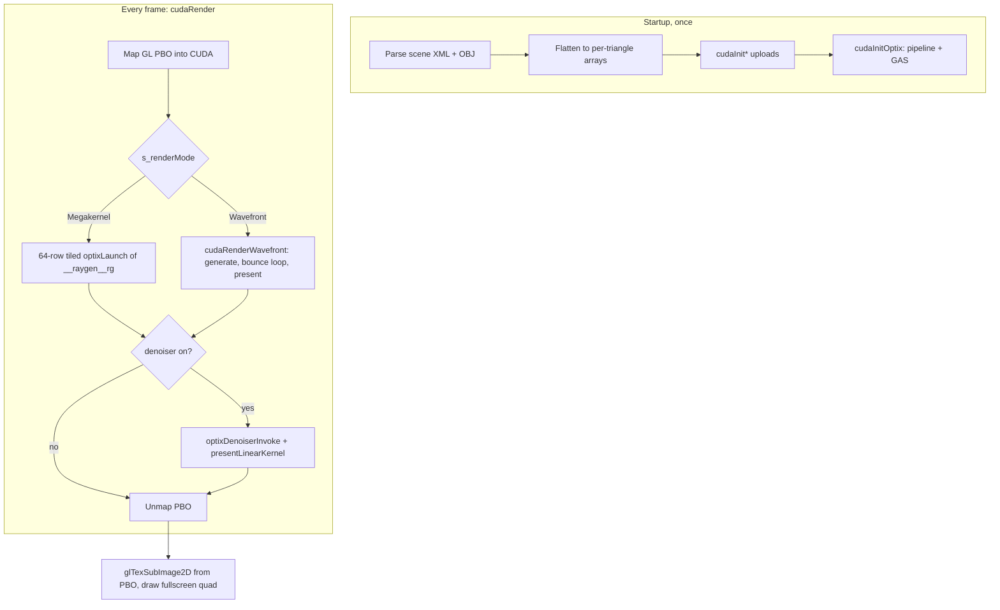

# Megakernel Walkthrough

A development refresher on how a frame actually gets rendered, written against the
code *after* the refactor that split the megakernel into shared headers and focused
translation units. Read this before touching the wavefront stages — roughly 90% of
`wfShade` is a call sequence into functions described here.

Companion docs: [WAVEFRONT_IMPLEMENTATION.md](WAVEFRONT_IMPLEMENTATION.md) (build
order, verification steps, signature reference),
[WAVEFRONT_GUIDE.md](WAVEFRONT_GUIDE.md) (per-stage spec), and
[WAVEFRONT_DEEP_DIVE.md](WAVEFRONT_DEEP_DIVE.md) (design rationale).

---

## Part 0 — State of the world

There are **two** path tracers in this repo, and they share their shading math:

1. **`__raygen__rg`** (`src/optix_programs.cu:54`) — the live megakernel. One OptiX
   thread per pixel runs an entire path, with traversal on the RT cores via
   `optixTrace`. `SAMPLES_PER_PIXEL = 5`, `MAX_BOUNCES = 200`.
2. **The wavefront pipeline** — host loop and buffers are fully written
   (`cudaRenderWavefront`, `src/host/wavefront_host.cu:152`), OptiX
   pipeline/SBTs/buffers are wired, and all five stage kernels are `TODO` stubs.

The original hand-rolled CUDA megakernel with CPU-BVH traversal is **gone**, along
with `bvh_builder.{cpp,h}`, `LinearBVHNode`, the software traversal in
`rt_intersect.cuh`, and `cudaInitEmitters`' never-read emissive-triangle arrays. It
was provably unreachable — nothing launched `renderKernel` and its `__constant__
CameraData d_camera` was never populated — so its useful parts were promoted into
shared headers instead of being kept as a second copy of the algorithm.

**Important:** `USE_WAVEFRONT = true` at `src/main.cpp:51`, so building and running
right now gives you a **black window** — every wavefront stage is a stub, including
the one that writes the PBO. Flip that flag to `false` to see the working renderer.

Still vestigial, so you don't waste time on it: `<emitter>` XML tags are parsed into
`scene.emitters` but never consumed (lights come only from `<mesh isEmitter="...">`),
nothing calls `markSceneChanged()` (`src/main.cpp:59`), and
`framebufferSizeCallback` (`src/main.cpp:599`) only calls `glViewport`, so resizing
the window doesn't resize the PBO or texture.

---

## Part 1 — Frame architecture

Both modes now converge on the same tail: write the running mean into the PBO, then
optionally overwrite it with the denoised tonemap.

### Where the code lives

The 1817-line `src/render_kernel.cu` was split by concern. `render_kernel.h` is
unchanged — the public API is identical, only its implementation moved.

| File | Contents |
| --- | --- |
| `src/render_kernel.cu` | `cudaRegisterPBO`, `cudaResetAccumulation`, `cudaRender` (mode dispatch + tiled megakernel launch), `cudaCleanup`, `cudaSetRenderMode`/`cudaGetRenderMode` |
| `src/host/renderer_state.{h,cu}` | every `s_*` device pointer, count, and OptiX/denoiser handle, in one definition with an internal header of `extern`s |
| `src/host/cuda_check.h` | `CUDA_CHECK` / `OPTIX_CHECK` |
| `src/host/optix_setup.cu` | `ensureOptixPipeline`, `buildGAS`, `cudaInitOptix`, `freeOptixState` |
| `src/host/scene_upload.cu` | every `cudaInit*` uploader plus `freeSceneUploads` |
| `src/host/denoiser.cu` | `presentLinearKernel`, `ensureDenoiser`, `denoiseAndPresent`, `cudaToggleDenoiser` |
| `src/host/wavefront_host.cu` | `ensureWavefrontBuffers`, `buildSceneView`, `cudaRenderWavefront`, `freeWavefrontState` |

The device-side shading logic moved into header-only helpers. The bodies are
verbatim from the pre-refactor megakernel; the only change is that data arrives
through explicit parameters instead of the `params` launch constant, which is
precisely what makes them callable from plain CUDA wavefront kernels.

| Header | Contents | OptiX-dependent? |
| --- | --- | --- |
| `rt_constants.cuh` | `SAMPLES_PER_PIXEL`, `MAX_BOUNCES`, `RT_EPSILON` | no |
| `rt_camera.cuh` | `generatePrimaryRay` | no |
| `rt_shading_context.cuh` | `PathState`, `DirectLightingContext`, `ShadowRayRecord` | no |
| `rt_material.cuh` | `loadBsdfForTriangle` (BSDF fetch + texture override) | no |
| `rt_direct_lighting.cuh` | `convertAreaPDFtoSolidAnglePDF`, `accumulateEmitterHit`, `prepareAreaEmitterNEE`, `prepareSpotlightNEE` | no |
| `rt_path_integrator.cuh` | `scatterPath`, `russianRoulette`, `accumulateWelford`, `packPixelGamma` | no |
| `rt_optix_shading.cuh` | pointer packing, `traceClosest`, `traceOccluded`, `LaunchParams` context builders, `sampleAreaEmitterNEE`/`sampleSpotlightNEE` wrappers, `traceRay` | **yes** |
| `wavefront/wavefront_shading.cuh` | `loadPathState`/`storePathState`, `loadIntersection`, `WfSceneView` context builders, `enqueueShadowRay` | no |

The split point that matters: everything in the "no" rows compiles into both plain
CUDA translation units and PTX translation units. `rt_optix_shading.cuh` calls
`optixTrace`, so it may only be included from PTX TUs (`optix_programs.cu`,
`wavefront/ray_extend.cu`, `wavefront/ray_connect.cu`).

---

## Part 2 — Host startup, step by step

**Step 1 — Camera, before any GL exists.** `src/main.cpp:618-649` reads the
look-at/up vectors from the scene XML, builds an orthonormal basis (`forward`,
`right`, `up`), and calls `cudaInitCamera`, which only copies into `s_camera_h`
(`src/host/scene_upload.cu:70`). The camera reaches the GPU later, inside
`LaunchParams` (megakernel) or as a by-value kernel argument (wavefront generate).

**Step 2 — GL + PBO.** `initGL` (`src/main.cpp:212`) creates a fullscreen-quad VAO,
a screen-sized `GL_RGBA8` texture, a `width*height*4` PBO, and a trivial
textured-quad shader. `cudaRegisterPBO` (`src/main.cpp:928`) hands the PBO to CUDA
so kernels can write RGBA8 directly into it.

**Step 3 — Scene flattening.** This is the conceptual heart of the data model, and
the reason everything downstream is so simple: **the scene is one flat triangle array
with parallel per-triangle side tables.** `src/main.cpp:788-860` walks each mesh,
loads its OBJ via tinyobjloader with the XML transform baked in, appends triangles to
a global vector, and pushes one entry per triangle into each of
`triangleMaterialIds`, `triangleBsdfIds`, `triangleEmitterFlags`, and
`triangleEmission`.

**Step 4 — Emitter tables.** Built in the same walk (`src/main.cpp:816-859`): one
`EmitterData` per emissive mesh holding offsets into a concatenated
`emitterTriIndices` array and a concatenated per-emitter area CDF (`emitterTriCdf`),
plus `areaSum` and `powerWeight = areaSum * luminance(radiance)`. On top of that sits
`sceneEmitterCdf`, a power-weighted prefix CDF over emitters. So light sampling is a
two-level draw: pick an emitter proportional to power, then pick a triangle within it
proportional to area.

**Step 5 — Uploads.** `cudaInitScene` (`src/main.cpp:868`) → `cudaInitOptix`
(line 875) → emission → emitter flags → emitter tables → BSDFs → spotlights →
textures. Each is a straightforward free-then-`cudaMalloc`-then-`cudaMemcpy` into a
device pointer owned by `renderer_state.cu`; they all now live in
`src/host/scene_upload.cu`.

Note that `cudaInitOptix()` takes no arguments. It used to be `cudaInitBVH(nodes,
nodeCount, primIndices, primCount)`, which passed four nulls and ignored them — a
leftover from the CPU-BVH era.

**Step 6 — OptiX pipeline** (`ensureOptixPipeline`, `src/host/optix_setup.cu:33`).
Worth re-reading, because the wavefront work already lives here. It creates one
module from the embedded PTX, then **six** program groups: `__raygen__rg`,
`__raygen__wf_extend`, `__raygen__wf_shadow`, `__miss__radiance`, `__miss__shadow`,
`__closesthit__radiance`. All six link into a single pipeline (line 122) because
OptiX validates every referenced entry point at link time. Then it builds **three
SBTs** that share the same miss and hitgroup device pointers and differ only in the
raygen record (lines 187-191) — swapping which SBT you pass to `optixLaunch` is how
you select which raygen runs. `maxTraceDepth = 2` because the megakernel traces a
shadow ray from inside a radiance-ray context.

**Step 7 — GAS build** (`buildGAS`, `src/host/optix_setup.cu:202`). One critical
invariant: it packs a `3 * triCount` vertex buffer straight out of the interleaved
`TriangleData` with a strided `cudaMemcpy2D`, with no index buffer. That means
**OptiX primitive index == scene triangle index**, which is why
`optixGetPrimitiveIndex()` can index `triangleBsdfIds`, `triangleEmission`, and
friends directly. Do not break this.

**What changes for wavefront:** nothing in Part 2. Every buffer, table, the GAS, the
pipeline, and all three SBTs are already correct and shared.

---

## Part 3 — The megakernel frame (`cudaRender`, `src/render_kernel.cu:58`)

It maps the PBO, dispatches to `cudaRenderWavefront` if the mode says so, and
otherwise fills one `LaunchParams` struct with every device pointer plus the camera
and `frameIndex`, then renders in **64-scanline horizontal bands** (lines 117-129),
re-uploading `LaunchParams` with a new `launchOffsetY` per band and syncing after
each. The bands exist purely to keep any single GPU command short enough to avoid the
Windows TDR watchdog; output is bit-identical to one full-frame launch. Then
`++s_frameIndex`, optional denoise, unmap.

`cudaCleanup` (line 143) now delegates to `freeSceneUploads` / `freeDenoiserState` /
`freeWavefrontState` / `freeOptixState`, each owned by the file that allocated the
memory.

---

## Part 4 — The path loop, step by step

`__raygen__rg` (`src/optix_programs.cu:54`) is now ~50 lines: it owns the pixel
mapping, the SPP loop, `PathState` initialisation, and the accumulate/present tail.
Each bounce is one call to `traceRay` (`rt_optix_shading.cuh:186`), which is the
function whose sequence `wfShade` reproduces across stages.

**Step 1 — Pixel and RNG seed** (`optix_programs.cu:56-65`). `y` gets
`params.launchOffsetY` added to undo the band tiling. Then
`rng = makeRng(hashUint(pixelIndex ^ (frameIndex * 0x9e3779b9u)))`. `RngState` is
literally one `uint32_t` xorshift32 (`rt_rng.cuh:19`) — which is exactly why
`WavefrontSoA::rngState` can be a plain `uint32_t*`. There is no `rngInit()`.

Also note line 61: `makeDirectLightingContext(params)` is built **once**, outside
the SPP loop, and passed down into every shading call. This is the `params`-free
plumbing that lets the same functions serve both pipelines — the wavefront builds
the identical struct from `WfSceneView` instead
(`wavefront_shading.cuh:90`).

**Step 2 — SPP loop** (line 69). Five independent paths per pixel per frame,
averaged at line 100.

**Step 3 — Jitter and primary ray.** Two RNG draws give sub-pixel offsets in
`[-0.5, 0.5]`; `generatePrimaryRay` (`rt_camera.cuh:15`) maps pixel → NDC →
`forward + right*sx + up*sy`. Jittering per path (not per frame) is what gives
antialiasing.

**Step 4 — `PathState` init** (lines 74-83). Note `specularBounce = true` on the
camera ray. This is not a claim that a camera ray is a delta scatter — it's an MIS
device meaning "no NEE was performed for the bounce that produced this ray", which
makes a camera ray landing directly on a light contribute its **full** radiance
rather than an MIS-weighted fraction.

**Step 5 — Bounce loop** (line 85), each iteration calling `traceRay`:

- **5a. Closest hit** (`traceClosest`, `rt_optix_shading.cuh:57`). Stack-allocates an
  `Intersection`, splits its 64-bit address across two payload registers, and traces.
  `__closesthit__radiance` (`optix_programs.cu:110`) unpacks the pointer and fills
  `t`, `triangleIndex`, `hitPoint`, the barycentrically interpolated `hitNormal`, and
  the interpolated `uv`. The raw barycentrics are consumed and discarded, which is
  why `Intersection` has no `baryU`/`baryV` and the wavefront hit buffer doesn't
  store them. `__miss__radiance` just sets `triangleIndex = -1`; a miss returns
  `false` and the path ends with whatever radiance it already had.

- **5b. Material fetch + texture override** (`loadBsdfForTriangle`,
  `rt_material.cuh:15`). `bsdfs[triangleBsdfIds[triIdx]]` is copied **by value** so it
  can be mutated locally: if the material has a texture, `tex2D<float4>` overwrites
  `bsdf.p0.xyz` (albedo), and for `BSDF_Microfacet` it recomputes
  `p1.w = 1 - max(albedo)` to keep the specular/diffuse split energy-conserving.

- **5c. Emitter hit / BRDF-side MIS** (`accumulateEmitterHit`,
  `rt_direct_lighting.cuh:59`). If the triangle is emissive: when the previous bounce
  was specular, weight = 1. Otherwise NEE already sampled this light from the previous
  vertex, so we take only our share:
  `weight = brdfPDF / (brdfPDF + lightPDF_solidAngle)`. Getting `lightPDF` requires
  reverse-mapping the triangle to its emitter via `findEmitterIndexForTriangle`, which
  is an **O(emitters × tris-per-emitter) nested linear scan**
  (`rt_emitter_sampling.cuh:132`) — a real optimization target later. The area →
  solid-angle conversion is `pdf_area * dist² / |cos θ_light|`
  (`rt_direct_lighting.cuh:35`). `checkRadiance` zeroes the contribution for
  back-facing lights. This function is trace-free, so both pipelines call it
  unchanged.

- **5d. Routing** (`rt_optix_shading.cuh:207-213`). `bsdfIsDiffuse(bsdf)` → do NEE and
  set `specularBounce = false`; otherwise skip NEE and set `specularBounce = true`.
  Note this is decided from the **BSDF type**, not from what `bsdfSample` actually did
  — `BsdfQueryRecord` has no `sampledType` field.

- **5e. Area-light NEE.** Split in two after the refactor.
  `prepareAreaEmitterNEE` (`rt_direct_lighting.cuh:106`) does all the math: two RNG
  draws → `sampleGenerator` picks emitter then triangle and fills the
  `EmitterQueryRecord`; the estimator is
  `fr * Le * lightWeight * geo / pdf_area * throughput`, where
  `lightWeight = lightPDF / (brdfPDF + lightPDF)` is the light-side MIS weight
  complementary to 5c. It writes that into a `ShadowRayRecord` (origin, direction,
  `tMax = dist - RT_EPSILON`, contribution) and returns `false` for the samples that
  carry no energy. The megakernel wrapper `sampleAreaEmitterNEE`
  (`rt_optix_shading.cuh:132`) then calls `traceOccluded` and adds `contribution` if
  unoccluded. The wavefront calls `prepareAreaEmitterNEE` and enqueues the record
  instead.

- **5f. Spotlight NEE.** Same split: `prepareSpotlightNEE`
  (`rt_direct_lighting.cuh:174`) handles **one** spotlight (smoothstep cone falloff,
  inverse-square attenuation), and the wrapper `sampleSpotlightNEE`
  (`rt_optix_shading.cuh:153`) keeps the `for (si < spotlightCount)` loop. **No MIS**
  — a point light is a delta distribution that BRDF rays can never hit, so
  `lightWeight` is implicitly 1.

- **5g. Scatter** (`scatterPath`, `rt_path_integrator.cuh:25`).
  `wi = toLocalFromNormal(n, -rayDir)`, one extra RNG draw into `rndExtra` for Disney
  lobe selection, two more for the sample. **`bsdfSample` returns the throughput
  multiplier as its `Float3` return value** and writes `wo` and `eta` into the record
  — there is no `.value` or `.pdf` field, and the PDF must be fetched with a separate
  `bsdfPdf(bsdf, rec)` call. Then the new origin is offset along the bounce direction
  by `RT_EPSILON` (there is no `faceForward`), `throughput *= sampleWeight`, and
  `eta *= rec.eta`.

**Step 6 — Russian roulette** (`russianRoulette`, `rt_path_integrator.cuh:54`;
called at `optix_programs.cu:91`). Only after bounce 3.
`continuationProb = min(maxCoeff3(throughput) * eta², 0.99f)` — note the **0.99 cap,
not 1.0**, and the `eta²` factor which preserves radiance scaling through refractive
interfaces. Survivors divide throughput by the probability to stay unbiased; the
function returns whether the path continues.

**Step 7 — Accumulate and present** (`optix_programs.cu:100-107`). The 5 samples are
averaged, folded into the linear `accumBuffer` by `accumulateWelford`
(`rt_path_integrator.cuh:72`) with the streaming mean
`new = prev + (sample - prev) / (frameIndex + 1)`, then gamma-2.2 encoded and packed
ABGR into the PBO by `packPixelGamma`. Accumulation is in **linear** space; gamma is
applied only at display. `presentLinearKernel` in the denoiser reuses
`packPixelGamma`, so there is now exactly one gamma encode in the codebase.

**Step 8 — Denoise** (optional, `D` key). `optixDenoiserInvoke` on the accumulated
linear buffer into `s_denoisedBuffer_d`, then `presentLinearKernel`
(`src/host/denoiser.cu:21`) re-tonemaps over the raygen's PBO write.

---

## Part 5 — What the wavefront refactor changes

**Stays byte-for-byte identical:** all five BSDFs, `bsdfEval`/`bsdfPdf`/`bsdfSample`,
the emitter sampling and CDF machinery, `toLocal`/`toWorldFromNormal`, the RNG, the
MIS math, the area → solid-angle conversion, the RR formula, the Welford blend, the
gamma encode, the epsilon conventions. You are rearranging *when and where* they're
called, not rewriting them.

After the refactor this is no longer aspirational: the shared functions are the same
symbols both pipelines call. `wfShade` is meant to be glue, not ported math.

| Megakernel (in `traceRay`) | Wavefront stage | Shared function called |
| --- | --- | --- |
| `generatePrimaryRay` | generate (`wfGenerate`) | `rt_camera.cuh` |
| `traceClosest` | extend (`__raygen__wf_extend`) | `rt_optix_shading.cuh` |
| `loadBsdfForTriangle` | shade (`wfShade`) | `rt_material.cuh` |
| `accumulateEmitterHit` | shade | `rt_direct_lighting.cuh` |
| `sampleAreaEmitterNEE` | shade → `prepareAreaEmitterNEE` + `enqueueShadowRay` | `rt_direct_lighting.cuh` |
| `sampleSpotlightNEE` | shade → `prepareSpotlightNEE` per light + enqueue | `rt_direct_lighting.cuh` |
| `scatterPath` | shade | `rt_path_integrator.cuh` |
| `russianRoulette` | shade | `rt_path_integrator.cuh` |
| `traceOccluded` + add | connect (`__raygen__wf_shadow`) | `rt_optix_shading.cuh` |
| `accumulateWelford` + `packPixelGamma` | present (`wfPresent`) | `rt_path_integrator.cuh` |

Also unchanged: the entire host setup, the GAS, the pipeline, and the
`__closesthit__radiance` / `__miss__radiance` / `__miss__shadow` programs, reused
verbatim by extend and connect.

**What actually changes** is that per-thread stack state becomes persistent global
SoA state, and the single fused loop becomes four launches per bounce plus a terminal
present:

- `PathState` on the stack → `WavefrontSoA` arrays indexed by path slot. `radiance`
  is the SoA name for `accumulatedColor`. `loadPathState`/`storePathState`
  (`wavefront_shading.cuh:31`) convert between the two, so the shared functions still
  see a plain `PathState&`.
- `traceClosest` → `__raygen__wf_extend`, which writes results to the hit buffer
  instead of returning them in registers, because registers don't survive a kernel
  boundary.
- `traceOccluded` (a synchronous inline call) → **deferred**: `wfShade` calls
  `prepare*NEE` and writes the resulting `ShadowRayRecord` into the shadow SoA via
  `enqueueShadowRay`; `__raygen__wf_shadow` fires it later and conditionally
  `atomicAdd`s the contribution into `wf.radiance`. This deferral is the single
  biggest semantic change.
- The `while (bounceCount < MAX_BOUNCES)` loop → a host-side `for` loop with a
  device→host `cudaMemcpy` of the active count each bounce.
- Because a CUDA kernel cannot reach `extern "C" __constant__ LaunchParams params`,
  `wfGenerate`/`wfShade`/`wfPresent` receive `WfSceneView` by value instead (built by
  `buildSceneView`, `src/host/wavefront_host.cu:122`). Same pointers, different
  delivery.

**One behavioral nuance from the split:** the visibility test now runs *after* the
contribution math, where the original bailed out early on an occluded ray. The image
is identical — occluded samples just do a little extra arithmetic. This reordering is
unavoidable, since the wavefront has to precompute the contribution before the shadow
ray is ever traced.

### Two queues, and a terminal present stage

Two structural fixes in the scaffolding are worth understanding before you write
kernels, because both were latent correctness bugs:

**Ping-pong ray queues.** A single queue races: `wfShade` reads path indices out of
`rayQueue[queueSlot]` while appending survivors with `atomicAdd` into the *same*
buffer, and block execution order is undefined, so a thread appending to slot 3 can
clobber the entry another thread hasn't read yet. `WavefrontSoA` now has
`rayQueue`/`rayCount` (read this bounce) and `rayQueueNext`/`rayCountNext` (append
here); the host swaps both pairs after each bounce
(`src/host/wavefront_host.cu:217`). `wfShade` must never write to `wf.rayQueue`.

**Accumulation happens once, in present.** `connect` runs *after* `shade` each
bounce, so if `shade` accumulated the moment a path died, a path that emitted NEE
shadow rays and then died to Russian roulette in the same call would snapshot its
radiance *before* those contributions landed — silently dropping direct lighting on
terminating paths, while paths surviving to the bounce cap would never accumulate at
all. With one path per pixel per frame, `wf.radiance[idx]` is final once the loop
exits, so `wfPresent` (`src/wavefront/ray_present.cu`) does the Welford blend and
gamma pack for all N pixels in one pass. That also fixes the wavefront path never
writing to the PBO, and gives the denoiser back in wavefront mode for free.

### Build wiring

`src/optix_programs.cu`, `src/wavefront/ray_extend.cu`, and
`src/wavefront/ray_connect.cu` are in the `optix_programs` OBJECT library with
`CUDA_PTX_COMPILATION ON` (`CMakeLists.txt:78-86`), and their PTX is
text-concatenated into one blob by `cmake/bin2c_wrapper.cmake` before `bin2c`, so all
three share one module and the single `params` definition in `optix_programs.cu`.
`ray_generate.cu`, `ray_shade.cu`, and `ray_present.cu` are ordinary CUDA sources on
the executable alongside the `src/host/*.cu` files (`CMakeLists.txt:111-124`). Adding
a new OptiX program means adding a file to the OBJECT library; adding a new
host-launched kernel means adding it to the executable.

---

## Part 6 — What's already built vs. stubbed

Done and working: SoA allocation/teardown (`ensureWavefrontBuffers`,
`src/host/wavefront_host.cu:67`), `WfSceneView` packing, the two extra program groups
and SBTs, `LaunchParams.wf`, the host bounce loop with queue ping-pong, all counter
resets and syncs, the present + denoise tail, and the three host launcher wrappers
(extend and connect are `optixLaunch` calls inline in the loop).

Stubbed, in dependency order: `wfGenerate`, `__raygen__wf_extend`, `wfShade` (by far
the largest), `__raygen__wf_shadow`, `wfPresent`. Each stub file's header comment now
describes the real API — including the exact call sequence and the shared functions to
use — so the guidance and the code agree.

For the build order, the per-step verification, and a signature reference for
everything you'll call, work from
[WAVEFRONT_IMPLEMENTATION.md](WAVEFRONT_IMPLEMENTATION.md). In short: `wfGenerate` and
`wfPresent` together first (present is ~3 lines, and generate is what initialises the
SoA it reads), then extend with a hit-normal debug view, then shade's miss path, then
shade without NEE, then NEE + connect.

---

## Part 7 — Sharp edges that remain

The scaffolding bugs from the first pass are fixed. These are the ones still live:

**1. Wavefront runs 1 sample per pixel per frame; the megakernel runs 5.** At equal
frame counts the wavefront image will look ~5× noisier even when perfectly correct.
Compare at equal *sample* counts, or temporarily set `SAMPLES_PER_PIXEL = 1` when
A/B-ing.

**2. The SoA is not zeroed at allocation.** `ensureWavefrontBuffers` only
`cudaMalloc`s. That's fine once `wfGenerate` is implemented, since it writes every
field of every slot each frame — but it does mean `wfPresent` must not be the first
stage you bring up on its own: it would read an uninitialized `radiance` and, worse,
index the framebuffer with an uninitialized `pixelIndex`. Implement `wfGenerate`
first, or `cudaMemset` the SoA during bring-up.

**3. Up to 200 host round-trips per frame.** The bounce loop does a blocking
`cudaMemcpy` of `rayCount` plus a `cudaDeviceSynchronize` per stage, and
`MAX_BOUNCES` is now the shared 200. RR kills most paths by bounce ~5, so the loop
exits early in practice, but this is why wavefront won't beat the megakernel until
the queue-empty check is moved off the critical path (persistent kernels, CUDA graphs,
or checking every N bounces).

**4. `findEmitterIndexForTriangle` is an O(emitters × tris) scan** on every emissive
hit (`rt_emitter_sampling.cuh:132`). It's shared, so it costs both pipelines equally,
but it will show up in wavefront profiles as time inside `wfShade`. A per-triangle
`emitterIndex` side table would make it O(1) and is a strictly local change.

**5. `maxShadows` is sized `maxPaths * (1 + spotlightCount + 1)`**
(`src/host/wavefront_host.cu:82`). `enqueueShadowRay` defensively drops rays past the
cap rather than corrupting memory, but a silent drop is a silent energy loss — if you
ever add more NEE samples per hit, grow this first.

**6. Accumulation never resets on camera/scene edits.** Nothing calls
`markSceneChanged()` (`src/main.cpp:59`), and `framebufferSizeCallback`
(`src/main.cpp:599`) only calls `glViewport`, so resizing doesn't resize the PBO or
texture. Both predate the refactor and are unrelated to it.

---

## Verifying the refactor

The megakernel's logic, variable names, and RNG draw order are unchanged, so it
should be **pixel-identical** to the pre-refactor build. To confirm:

1. Set `USE_WAVEFRONT = false` (`src/main.cpp:51`).
2. Build and let it converge to a fixed frame count.
3. Compare against a pre-refactor capture at the same frame count.

Any difference is a refactor bug, not a tuning question — the only intentional
behavioral change is the NEE visibility-test reordering in Part 5, which cannot alter
the result.
